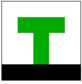

Run this example with webpack: `node_modules/.bin/webpack-dev-server --open`. Bundle this example: `webpack [-p]`.

## This Will Show You How to

* Initialize the engine
* Load a map with a simple layout
* Use a tileset

## Step by Step

Welcome to the first example! Here you will learn the basics. This "game" is not really playable. Instead it will demonstrate how to load maps, and how to think in tiles.

Let's start with creating an environment for our game:

```html
<!-- index.html -->
<html>
  <head>
    <link rel="stylesheet" href="style.css">
  </head>
  <body>
    <script src="index.js"></script>
  </body>
</html>
```

This looks really simple, but we won't need more for this example. The [stylesheet](style.css) only defines some background colors. The rest of the initialization will be handled in the script file:

```js
// index.js
import TileEngine from '../../src/engine'; // or wherever the engine directory is

// Create a new TileEngine instance:
let tileEngine = new TileEngine(
  // Engine viewport:
  0, 0,  // start rendering at (x=0, y=0)
  5, 5   // render until (x=4, y=4)
);

tileEngine.init('./map.json'); // Rendering starts here
```

The [map](map.json) looks fairly easy too, it's a simple JSON-file. We'll discuss it step by step:

```json
{
  "width": 5,
  "height": 5,
  "tileHeight": 32,
  "tileWidth": 32,
  [...]
}
```

This map measures 5 x 5 tiles of 32px x 32px each. You can think of tiles as the basic building blocks of the map.

```json
{
  [...]
  "tilesets": [
    {
      "image": "./tiles.png",
      "tileWidth": 32,
      "tileHeight": 32,
      "imageheight": 32,
      "imagewidth": 64,
      "spacing": 0,
      "firstgid": 1
    }
  ],
  [...]
}
```

Map tiles can come from multiple tile sets. A set might contain tiles grouped by context, level, or source, for example. A tile set is based on an image in which all of the different tiles of the set are concatenated. This makes organizing and loading these base images easier.


This particular tile set has just two tiles: a white square and a black square. Both are 32px x 32px, so the image is the same height and double the width. There is no spacing between the different tiles. You could have a 1px line separating the tiles for clarity. This would require `"spacing": 1`.

`"firstgid": 1` tells the engine that the tiles in this set are counted from 1. So the white tile is 1, the black tile is 2.

```json
{
  [...]
  "layers":[
    {
      "name": "Example",
      "tileset": 0,
      "width": 5,
      "height": 5,
      "visible": true,
      "layout": [
        1, 1, 1, 1, 1,
        1, 0, 0, 0, 1,
        1, 1, 0, 1, 1,
        1, 1, 0, 1, 1,
        2, 2, 2, 2, 2
      ]
    }
  ]
}
```

Let's ignore [the possibility of multiple layers](../02%20-%20Layers) for a moment and focus on the single layer we have here. The `Example` layer uses the tile set we just created (tile sets are identified by their position in the ´tilesets´ array - so they start with index 0) and consists of five by five tiles. Also, the layer is visible, so it will be rendered. We will encounter some invisible layers [later](../04%20-%20Collision%20and%20pathfinding).

Then we define the actual layout of the tiles. Each location on the map (from [x=0, y=0] to [x=width-1, y=height-1]) is assigned a tile id. This is just a one-dimensional array, but the 2D-formatting in the file helps to visualize the map. Remember the tile ids from above? This is it, just black and white squares. Except it isn't: there are some zeros thrown into the mix. `0` - or anything that is not referenced in a tile set - is just a transparent tile, so we will see the background through here.



And that's it.


## What to do next?

### Try creating multiple tile sets

Note that you have to adapt the `firstgid` option of the second tile set to start after the first ended.

### Try creating more layers

Or read the [second tutorial](../02%20-%20Layers) on what to do with them.

### Want to re-use or share parts of the map? Here's what you do.

Place the JSON object you want to share between multiple map files in a separate file. Let's assume we externalize a layer to `shared/my-layer.json`:

`shared/my-layer.json`:
```json
  {
    "tileset": 0,
    "width": 3,
    "height": 3,
    "visible": true,
    "layout": [
      1, 1, 1,
      1, 0, 1,
      1, 1, 1
    ]
  }
```

Now you can use the layer inside multiple map files or multiple times in one map file, like in this example:

`map.json`:
```json
  [...]
  layers: [
    {
      "_load": "shared/my-layer.json",
      "_override": {
        "name": "First Layer",
        "x": 7,
        "y": 8
      }
    },
    {
      "_load": "shared/my-layer.json",
      "_override": {
        "name": "Second Layer",
        "x": 1,
        "y": 2
      }
    }
  ]
```

The object containing the `_load` attribute will be replaced by the engine with the whole content of the specified file. After that, all attributes of the `_override` object are merged into the result. This allows to use a template object and populate it with local attributes, without copying all of the attributes around multiple locations and files.

You can load any sub-tree from a map file:

`map.json`:
```json
  [...]
  layers: {
    "_load": "shared/layers.json",
    "_override": {}
  }
```

You can load files with `_load` directives in them up to 10 levels deep.


### Ready for your own adventure?

Go back to the [main page](../../README.md).
