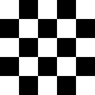
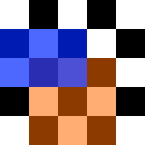
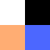
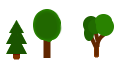
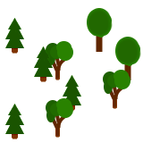

Run this example with webpack: `node_modules/.bin/webpack-dev-server --open`. Bundle this example: `webpack [-p]`.

## This Will Show You How to

* Create multiple layers
* Use transparency
* Use layers smaller than the map

## Step by Step

In this example we are re-using much of the last one. The html, js, and css files stay exactly the same. All our changes are made in the [map file](map.json) and the [tile set](tiles.png).

Now, let's change the map to have two layers:

```json
{
  "width": 5,
  "height": 5,
  "tileHeight": 32,
  "tileWidth": 32,
  "tilesets": [...],
  "layers":[
    {
      "name": "white",
      "tileset": 0,
      "width": 5,
      "height": 5,
      "visible": true,
      "layout": [
        1, 1, 1, 1, 1,
        1, 1, 1, 1, 1,
        1, 1, 1, 1, 1,
        1, 1, 1, 1, 1,
        1, 1, 1, 1, 1
      ]
    },
    {
      "name": "black",
      "tileset": 0,
      "width": 5,
      "height": 5,
      "visible": true,
      "layout": [
        0, 2, 0, 2, 0,
        2, 0, 2, 0, 2,
        0, 2, 0, 2, 0,
        2, 0, 2, 0, 2,
        0, 2, 0, 2, 0
      ]
    }
  ]
}
```

We have a completely white layer in the background and a layer with black squares every two tiles in the foreground. Their position in the array determines the order of rendering. If you don't want to order your layers in this way, you can use the `zIndex` attribute:

```json
{
  "layers":[
    {
      "name": "black",
      "zIndex": 1,
      [...]
    },
    {
      "name": "white",
      "zIndex": 0,
      [...]
    }
  ]
}
```

A lower `zIndex` will place the layer further in the background. Regardless of which ordering strategy we use, we end up with this image:



Nice! Now let's create two more layers.

```json
{
  [...]
  "layers":[
    [...]
    {
      "name": "orange",
      "tileset": 0,
      "width": 3,
      "height": 3,
      "x": 1,
      "y": 2,
      "zIndex": 3,
      "visible": true,
      "layout": [
        3, 3, 3,
        3, 3, 3,
        3, 3, 3
      ]
    },
    {
      "name": "blue",
      "tileset": 0,
      "width": 3,
      "height": 2,
      "x": 0,
      "y": 1,
      "zIndex": 4,
      "visible": true,
      "layout": [
        4, 4, 4,
        4, 4, 4
      ]
    }
  ]
}
```

You can use the `x` and `y` parameter to move layers around relative to the map. In conjunction with a smaller width and height, you can build layers that only use a small space on the map.



You will notice that you can see through the blue and orange layer. This is because the tiles in the [tile set](tiles.png) include an alpha channel (PNG allows transparency).



This is very useful for tiles that are not exactly squares, or large objects that partly occlude other objects behind them.

## What to do next?

### Try creating a forest

Consider these basic tiles:



Now we can use multiple layers to get a depth effect by stacking trees:

```json
{
  "width": 5,
  "height": 5,
  "tileHeight": 32,
  "tileWidth": 32,
  "tilesets": [
    {
      "firstgid": 1,
      "image": "./foresttiles.png",
      "imageheight": 64,
      "imagewidth": 128,
      "spacing": 0,
      "tileHeight": 32,
      "tileWidth": 32
    }
  ],
  "layers":[
    {
      "name": "background trees",
      "tileset": 0,
      "width": 5,
      "height": 5,
      "zIndex": 1,
      "visible": true,
      "layout": [
        1, 0, 0, 2, 0,
        5, 3, 4, 6, 2,
        0, 7, 8, 0, 6,
        0, 0, 5, 0, 0,
        0, 0, 0, 0, 0
      ]
    },
    {
      "name": "foreground tree",
      "tileset": 0,
      "width": 5,
      "height": 5,
      "zIndex": 2,
      "visible": true,
      "layout": [
        0, 0, 0, 0, 0,
        0, 1, 0, 0, 0,
        0, 5, 1, 3, 4,
        1, 3, 4, 7, 8,
        5, 7, 8, 0, 0
      ]
    }
  ]
}
```



Notice how the trees partly overlay each other.

### Want to populate your game?

Read the [next example](../03%20-%20Player%20and%20input) to add a player character and move it around.

### Ready for your own adventure?

Go back to the [main page](../../README.md).
