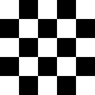
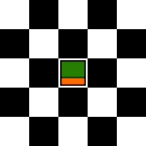
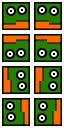
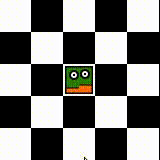

Run this example with webpack: `node_modules/.bin/webpack-dev-server --open`. Bundle this example: `webpack [-p]`.

## This Will Show You How to

* Create characters
* Use mouse and keyboard input
* Animate movement

## Step by Step

Again, in this example we are using parts of the previous one. The html and css files stay exactly the same. All our changes are made in the [map file](map.json) and the [tile set](tiles.png). To enable input, we also add options to the engine initialization in JavaScript.

We start with the checker board map from [the second example](../02%20-%20Layers):

```json
{
  "width": 5,
  "height": 5,
  "tileHeight": 32,
  "tileWidth": 32,
  "tilesets": [...],
  "layers":[
    {
      "name": "white",
      "tileset": 0,
      "width": 5,
      "height": 5,
      "visible": true,
      "layout": [
        1, 1, 1, 1, 1,
        1, 1, 1, 1, 1,
        1, 1, 1, 1, 1,
        1, 1, 1, 1, 1,
        1, 1, 1, 1, 1
      ]
    },
    {
      "name": "black",
      "tileset": 0,
      "width": 5,
      "height": 5,
      "visible": true,
      "layout": [
        0, 2, 0, 2, 0,
        2, 0, 2, 0, 2,
        0, 2, 0, 2, 0,
        2, 0, 2, 0, 2,
        0, 2, 0, 2, 0
      ]
    }
  ]
}
```



Now let's add a player character:

```json
{
  [...]
  "tilesets": [...],
  "characters": {
    "player": {
      "x": 2,
      "y": 2,
      "direction": 0,
      "sprites": "player.png",
      "framesPerDirection": 1,
      "width": 32,
      "height": 32,
      "zIndex": 3
    }
  },
  "layers":[...]
}
```



The orange part of the block represents the direction in which the player character is looking. `direction` is one of (`0`=down, `1`=up, `2`=left, `3`=right). The player sprites (its "animation steps") are organized in rows of a tiled image (with one frame per direction):


Cool. Now let's enable movement.

```js
// index.js
import TileEngine from '../../src/engine';
import MapLoader from '../../src/map';

(new MapLoader()).load('./map.json').then((map) => {
    let tileEngine = new TileEngine(0, 0, map.height, map.width, {enableKeyboardInput: true});
    tileEngine.init(map);
});
```

Nice, our little character move around when you press the arrow keys on your keyboard. If you want mouse or touch input, use `enableMouseInput: true`. They can be used at the same time, too. You will notice that the character will try to stay on tiles when moving somewhere. This is by design. Use a multiple of your map's tile width and height for the player sprites for the best results.

You can control the speed of the movement by setting the parameter `speed`. `x`, `y`, and `direction` can be set as well.

Let's have a look at animations. We'll need to set `framesPerDirection` to `2` and update the sprites accordingly:





## What to do next?

### Try to make a character move behind an object

tbd

### You want automatic pathfinding?

Read the [next example](../04%20-%20Collision%20and%20pathfinding) to automatically route characters across the map and let them avoid objects.

### Ready for your own adventure?

Go back to the [main page](../../README.md).
