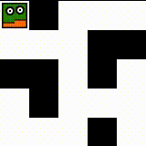
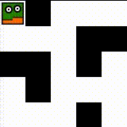
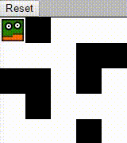

Run this example with webpack: `node_modules/.bin/webpack-dev-server --open`. Bundle this example: `webpack [-p]`.

## This Will Show You How to

* Define collision maps
* Use pathfinding
* Move a character without user input

## Step by Step

Let's start with a simple map:

```json
{
  "width": 5,
  "height": 5,
  "tileHeight": 32,
  "tileWidth": 32,
  "tilesets": [
    {
      "image": "./tiles.png",
      "tileHeight": 32,
      "tileWidth": 32
    }
  ],
  "characters": {
    "player": {
      "sprites": "player.png",
      "width": 32,
      "height": 32,
      "zIndex": 1,
      "framesPerDirection": 2
    }
  },
  "layers":[
    {
      "name": "objects",
      "tileset": 0,
      "width": 5,
      "height": 5,
      "zIndex": 2,
      "visible": true,
      "layout": [
        0, 2, 0, 0, 0,
        0, 0, 0, 2, 2,
        2, 2, 0, 2, 0,
        0, 2, 0, 0, 0,
        0, 0, 0, 2, 0
      ]
    }
  ]
}
```

In the last example, the character just moved over (or through) the black tiles. In this one, we want to make it find a way around the obstacles. Pathfinding is an important concept in almost every game, so it is built into the engine and you don't have to worry about implementing it by yourself. TIE uses JSIso's [A*](https://en.wikipedia.org/wiki/A*_search_algorithm) implementation with some modifications.

To add pathfinding to the character, add this to its definition: `"pathfindingLayer": 0`. In this case, 0 is the index of the object layer. The character will only move on `0` tiles and move around all other tiles. This works fine in our simple case:



However, in more sophisticated scenarios (multiple layers, overlaying objects, ...), this will not be sufficient. Therefore, you can also define a dedicated collision layer:

```json
{
  [...]
  "layers":[
    {
      "name": "collision",
      "tileset": 0,
      "width": 5,
      "height": 5,
      "zIndex": 0,
      "visible": false,
      "layout": [
        0, 1, 0, 0, 0,
        0, 0, 0, 1, 1,
        0, 1, 0, 1, 0,
        0, 1, 0, 0, 0,
        0, 0, 0, 1, 0
      ]
    },
    {
      "name": "objects",
      [...]
    }
  ]
}
```

Just create an invisible layer and reference it as the pathfinding layer in the character definition. Since it will never be rendered, we don't care about the numbers in the layout, except for the fact that `0` means "it's possible to move here" and all other IDs will be ignored.

You might have noticed a small difference between the collision map and the object layer. That's right, we just built a secret passage!



It is interesting to note, that collision will also impact keyboard-induced movement. The player will not move into an obstacle, even if it gets the direct command.

Another use case for pathfinding is in automatic actions (and events, as we will see [later](../06%20-%20Actions)). Let's build a button that resets the player to the start position:

```html
<!-- index.html -->
[...]
<body>
  <button id="resetButton">Reset</button>
</body>
[...]
```

```js
// index.js
  let tileEngine = new TileEngine(...);
  tileEngine.init('./map.json');

  // add this:
  document.getElementById('resetButton').addEventListener('click', (e) => {
    tileEngine.getCharacter('player').goTo(0, 0);
  });
```

Now when you click the button, the character will move to the tile (x=0, y=0). Pretty straight forward. There is one little problem: when the player is moving to the position (0, 0), its direction will be away from the center of the map, not towards it (as when you load the game):



Here is where another important concept comes into play: Events. Most objects in TIE are event handlers. This means you can register custom actions that will be executed when certain criteria are met. For this example we will need the "movementComplete" event of the player, to set the direction after the movement:

```js
  // index.js
  document.getElementById('resetButton').addEventListener('click', (e) => {
    let player = tileEngine.getCharacter('player');
    player.on('movementComplete', () => player.setDirection(0));
    player.goTo(0, 0);
  });
```

Cool. The character turns around once (0, 0) is reached. Unfortunately, it does the same after every movement, after we pressed the reset button. That's not what we wanted. Let's unset the callback after one movement:

```js
  // index.js
  document.getElementById('resetButton').addEventListener('click', (e) => {
    let player = tileEngine.getCharacter('player');
    player.on('movementComplete', () => {
      player.setDirection(0);
      player.off('movementComplete');
    });
    player.goTo(0, 0);
  });
```

If you give `off()` an ID of a handler, it will only remove this handler and leave other handlers intact. This is useful for more complex scenarios:

```js
  // index.js
  document.getElementById('resetButton').addEventListener('click', (e) => {
    let player = tileEngine.getCharacter('player');
    let id = player.on('movementComplete', () => {
      player.setDirection(0);
      player.off('movementComplete', id);
    });
    player.goTo(0, 0);
  });
```

To make this a bit easier, you can also register an event handler that is only valid once:

```js
  // index.js
  document.getElementById('resetButton').addEventListener('click', (e) => {
    let player = tileEngine.getCharacter('player');
    player.on('once:movementComplete', () => player.setDirection(0));
    player.goTo(0, 0);
  });
```

## What to do next?

### Try creating a character that follows the player

You can use the events from this example, as well as the methods `player.getTile()` and `player.getDirection()`.

Assuming we have created a button with `id="followButton"` and a character called "example-npc", we can use

```js
  // index.js
  // [...]
  // add this:
  document.getElementById('followButton').addEventListener('click', (e) => {
    let player = tileEngine.getCharacter('player');
    let npc = tileEngine.getCharacter('example-npc');
    npc.goTo(player.getTile().x, player.getTile().y);
    npc.on('once:movementComplete', () => npc.setDirection(player.getDirection()));
  });
```

Or consider this more complex variation, in which the NPC follows the player after each completed movement:

```js
  // index.js
  // [...]
  tileEngine.init('./map.json').then(() => {
    let player = tileEngine.getCharacter('player');
    let npc = tileEngine.getCharacter('example-npc');

    player.on('movementComplete', () => npc.goTo(player.getTile().x, player.getTile().y));
    npc.on('once:movementComplete', () => npc.setDirection(player.getDirection()));

    document.getElementById('resetButton').addEventListener('click', (e) => {
      player.goTo(0, 0);
      player.on('once:movementComplete', () => player.setDirection(0));
    });
  });
```

### Go to the next example

Learn about lighting in TIE in the [next example](../05%20-%20Lighting).

### Learn more about A* and other pathfinding algorithms

* Very good [introduction and analysis of A*](http://theory.stanford.edu/~amitp/GameProgramming/AStarComparison.html) including more use cases and optimizations
* [Interactive Demo](http://qiao.github.io/PathFinding.js/visual/) of many popular algorithms

### Ready for your own adventure?

Go back to the [main page](../../README.md).
