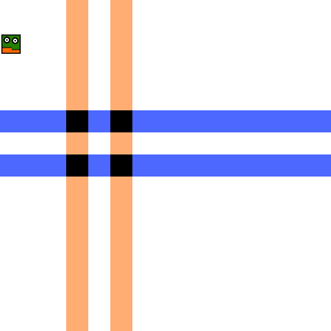
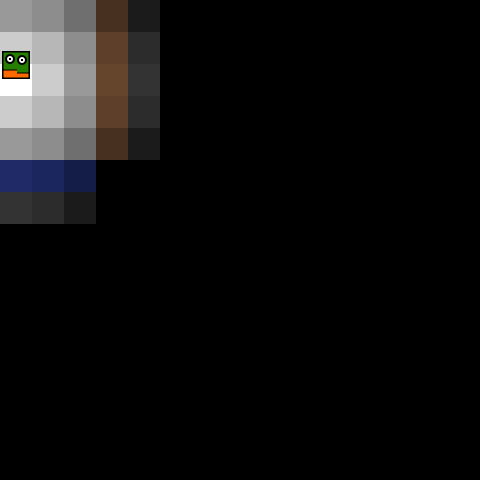
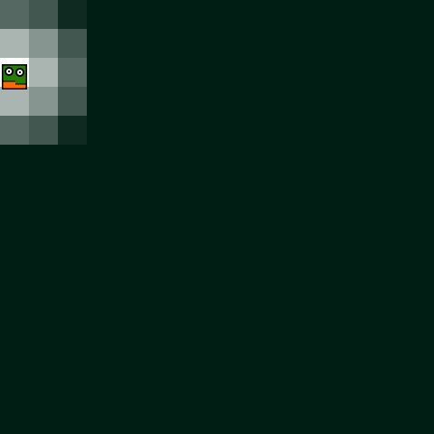
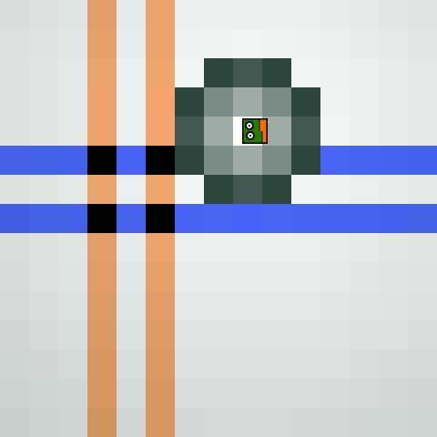
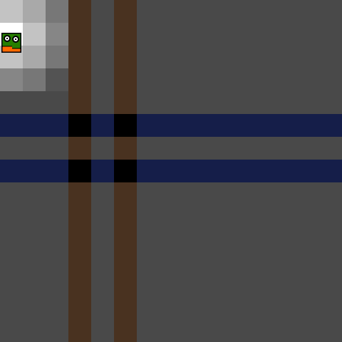
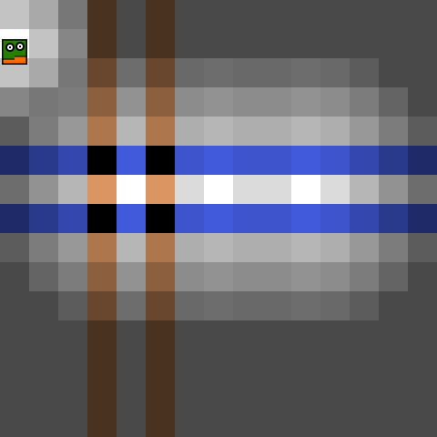

Run this example with webpack: `node_modules/.bin/webpack-dev-server --open`. Bundle this example: `webpack [-p]`.

## This Will Show You How to

* Use light and shadows
* Apply lighting to characters
* Create static light sources

## Step by Step

Let's start with a larger map this time:

```json
{
  "width": 15,
  "height": 15,
  "tilesets": [...],
  "characters": {...},
  "layers":[
    {
      "name": "background",
      "tileset": 0,
      "width": 15,
      "height": 15,
      "zIndex": 0,
      "visible": true,
      "layout": [
        1, 1, 1, 3, 1, 3, 1, 1, 1, 1, 1, 1, 1, 1, 1,
        1, 1, 1, 3, 1, 3, 1, 1, 1, 1, 1, 1, 1, 1, 1,
        1, 1, 1, 3, 1, 3, 1, 1, 1, 1, 1, 1, 1, 1, 1,
        1, 1, 1, 3, 1, 3, 1, 1, 1, 1, 1, 1, 1, 1, 1,
        1, 1, 1, 3, 1, 3, 1, 1, 1, 1, 1, 1, 1, 1, 1,
        4, 4, 4, 2, 4, 2, 4, 4, 4, 4, 4, 4, 4, 4, 4,
        1, 1, 1, 3, 1, 3, 1, 1, 1, 1, 1, 1, 1, 1, 1,
        4, 4, 4, 2, 4, 2, 4, 4, 4, 4, 4, 4, 4, 4, 4,
        1, 1, 1, 3, 1, 3, 1, 1, 1, 1, 1, 1, 1, 1, 1,
        1, 1, 1, 3, 1, 3, 1, 1, 1, 1, 1, 1, 1, 1, 1,
        1, 1, 1, 3, 1, 3, 1, 1, 1, 1, 1, 1, 1, 1, 1,
        1, 1, 1, 3, 1, 3, 1, 1, 1, 1, 1, 1, 1, 1, 1,
        1, 1, 1, 3, 1, 3, 1, 1, 1, 1, 1, 1, 1, 1, 1,
        1, 1, 1, 3, 1, 3, 1, 1, 1, 1, 1, 1, 1, 1, 1,
        1, 1, 1, 3, 1, 3, 1, 1, 1, 1, 1, 1, 1, 1, 1
      ]
    }
  ]
}
```



Okay, now we enable lighting by declaring `"useLighting": true` in the player character:

```json
  "player": {
    "sprites": "player.png",
    "width": 32,
    "height": 32,
    "zIndex": 1,
    "framesPerDirection": 2,
    "useLighting": true
  }
```



You can influence how lighting works on each layer separately. Just add some or all of the following options to the corresponding layers:

```json
  [...]
  "shadowDistance": {
    "distance": 3,
    "color": "0, 30, 20",
    "darkness": 1
  }
```

Basically we do not light anything, but instead draw shadows over the areas which are not near the player.
`distance` influences how far the "light" will reach. `"distance": 3` means three tiles are considered.
`color` determines the color of the shadow tiles. It's a string in the format `"red, green, blue"`.
The `darkness` parameter can be used for some neat graphical effects. `"darkness": 1` is the default. It means that tiles further away than `distance` are 100% of `color`. All other tiles are shaded according to their distance to the character.



`darkness < 1` will not color tiles out of `distance`. This means it can be used for an aura-like effect:



`darkness > 1` will affect the transparency of out-of-distance tiles. This means the higher this parameter, the lighter the shading. Use this to show that there is actually something somewhere in the distance.



Of course these parameters can be mixed and matched with multiple layers. For example this can be used to make some objects appear only if the character stands close to them, while showing all objects of a different layer all the time.

To enable static light sources, use the `lightmap` parameter of a layer:

```json
  [...]
  "shadowDistance": {
    "color": "0, 0, 0",
    "distance": 3,
    "darkness": 1.4
  },
  "lightmap": [
    [4, 6, 5, 1.4],
    [7, 6, 5, 1.4],
    [10, 6, 5, 1.4]
  ]
```



Static lights are organized in this way: `[x, y, distance, darkness]`. They use the shadow color.

## What to do next?

### Make your game more interactive

Have a look at the [next example](../06%20-%20Simple%20action) to learn about actions and events.

### Ready for your own adventure?

Go back to the [main page](../../README.md).
