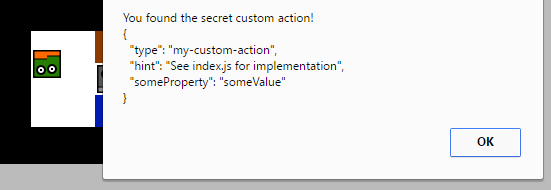

Run this example with webpack: `node_modules/.bin/webpack-dev-server --open`. Bundle this example: `webpack [-p]`.

## This Will Show You How to

* Add the actual mechanics to your game
* Use simple built-in actions
* Create custom actions in JavaScript

## Step by Step

Actions make your game more interactive by providing the player with the ability to change objects, trigger events, alter the map, and so on. This is where the game gets its mechanics.

### Simple Built-in Actions

There are some basic actions built-in:

| Name | Description |
|------|-------------|
| move | Moves a character |
| text | Displays text |
| toggleTile | Changes a tile to the next one of a given set of options |

Actions are defined in the map file:

```json
  [...]
  "layers": [...],
  "actions": [
    {
      "x": 0, "y": 0,
      "type": "text",
      "text": "This is an action to explain actions.",

      "next": {
        "type": "text",
        "tiles": "This is a text that appears after the first one."
      }
    },
    {
      "x": 2, "y": 5,
      "type": "text",
      "text": "This is another action on a different tile."
    },
    [...]
  ],
  [...]
```

Actions defined on the root level of the actions array should have x- and y-coordinates. They are triggered by pressing the `activate` key (\[Return\] / \[Space\]) when facing the tile declared in the action object. If the `type` of the action is `positional`, it is triggered by characters standing on or moving over the tile. You can chain actions by using the `next` attribute.

### Custom Actions

You can easily create your own actions. All you need is a reference to the engine object in JavaScript:

```js
// index.js
  let executeAction = (options, engine, player) => {
    alert(`You found the secret custom action!\n${JSON.stringify(options, true, 2)}`);
  }

  tileEngine.actionExecutor.registerAction('my-custom-action', executeAction);
```

The ActionExecutor manages all actions after they have been registered. The first parameter of the registerAction function is a string to be used to identify the action in the map file (== the `type` attribute). The second parameter is a function that is invoked when the action triggers. It gets called with the options of the action instance, a reference to the engine object and a reference to the character that is invoking the action.

Now you can reference the custom action in the map file:

```json
  [...]
  "actions": [
    {
      "type": "my-custom-action",
      "hint": "See index.js for implementation",
      "someProperty": "someValue"
    }
  ]
  [...]
```



Have a look into the [map file](map.json) to see all of the above examples in action.


## What to do next?

### Go to the next example

See all concepts from the previous tutorials working together in the [next example](../07%20-%20Putting%20it%20all%20together).

### Ready for your own adventure?

Go back to the [main page](../../README.md).
